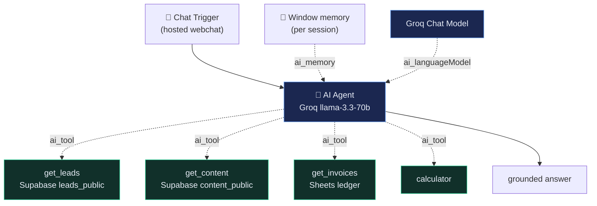

<h1 align="center">AI Ops Assistant</h1>

  <em>One AI agent on top of everything. Chat with it; it queries your live systems.</em> 
  A tool-using, memory-backed agent that answers questions about leads, content, and invoices —
  by calling real data, never guessing.

  
  
  
  

<!-- Live chat link + demo GIF slot — add once deployed: assets/demo.gif -->

---

## What it does

A hosted chat (n8n Chat Trigger) backed by an **AI Agent**. Ask it a question and it decides which
**tool** to call, fetches **live data**, and answers — with **conversation memory** so follow-ups
keep context.

- *"How many hot leads do we have?"* → calls the leads tool → answers from the CRM
- *"What content is pending approval?"* → calls the content tool
- *"Any invoices flagged for review?"* → calls the invoices tool
- *"What's the average score of this week's leads?"* → leads tool + calculator

**Why this design:** it's the capstone of a four-project portfolio — the **agentic, tool-using,
memory-backed** pillar — and it ties the other three systems together under one assistant.

## Architecture

The agent's data tools read **sanitized, read-only views** (anon key, RLS-protected) — no PII, no
write paths, safe to expose on a public chat.

## Stack (100% free, no card)

| Concern   | Tool                                       |
|-----------|--------------------------------------------|
| Chat UI   | n8n Chat Trigger (hosted webchat)          |
| Agent     | n8n AI Agent + Groq `llama-3.3-70b-versatile` |
| Memory    | Window Buffer Memory (per session)         |
| Data tools| Supabase sanitized views · Google Sheets   |

## Engineering decisions & what I learned

<!-- filled in as we build: tool-calling agent vs plain RAG, read-only sanitized tools for a safe
     public chat, tool descriptions as prompt surface, memory for multi-turn, grounding/no-guess
     system prompt, free-tier guardrails. -->

## Status

🚧 In progress — see [`docs/BUILD_GUIDE.md`](docs/BUILD_GUIDE.md) for the build order.

---

> The capstone of a 4-project automation portfolio:
> [Lead Qualification &amp; CRM](https://github.com/karl22puday-eng/ai-lead-qualification-system) ·
> [Content Engine](https://github.com/karl22puday-eng/ai-content-engine) ·
> [Invoice Processor](https://github.com/karl22puday-eng/ai-invoice-processor) ·
> **Ops Assistant** (this repo).
