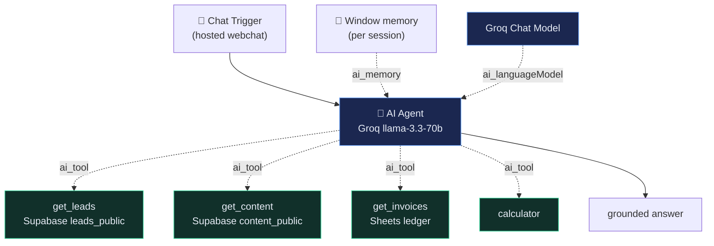

<h1 align="center">AI Ops Assistant</h1>

  <em>One AI agent on top of everything. Chat with it; it queries your live systems.</em> 
  A tool-using, memory-backed agent that answers questions about leads, content, and invoices —
  by calling real data, never guessing.

  
  
  
  

  <a href="https://karlchretien.app.n8n.cloud/webhook/40bc899d-cb2d-483f-afc3-01a4fe2a5280/chat"><b>💬 Try the agent live →</b></a> 
  Ask it "how many hot leads do we have?" or "what content is pending approval?"

---

## What it does

A hosted chat (n8n Chat Trigger) backed by an **AI Agent**. Ask it a question and it decides which
**tool** to call, fetches **live data**, and answers — with **conversation memory** so follow-ups
keep context.

- *"How many hot leads do we have?"* → calls the leads tool → answers from the CRM
- *"What content is pending approval?"* → calls the content tool
- *"Any invoices flagged for review?"* → calls the invoices tool
- *"What's the average score of this week's leads?"* → leads tool + calculator

**Why this design:** it's the capstone of a four-project portfolio — the **agentic, tool-using,
memory-backed** pillar — and it ties the other three systems together under one assistant.

## Architecture

The agent's data tools read **sanitized, read-only views** (anon key, RLS-protected) — no PII, no
write paths, safe to expose on a public chat.

## Stack (100% free, no card)

| Concern   | Tool                                       |
|-----------|--------------------------------------------|
| Chat UI   | n8n Chat Trigger (hosted webchat)          |
| Agent     | n8n AI Agent + Groq `llama-3.3-70b-versatile` |
| Memory    | Window Buffer Memory (per session)         |
| Data tools| Supabase sanitized views · Google Sheets   |

## Engineering decisions & what I learned

- **A tool-calling agent, not plain RAG.** The agent *decides* which tool to call and can compose
  results (e.g. pull leads, then run the calculator on them). That's a different capability from
  single-shot retrieval — it reasons about *which* data it needs and *what to do* with it.
- **Read-only, sanitized tools = a safe public chat.** Every data tool hits an RLS-protected
  sanitized view (`leads_public`, `content_public`) via the anon key — no PII, no write paths. The
  agent literally *cannot* mutate or leak sensitive data, so the chat can be exposed publicly.
- **Tool descriptions are the real prompt engineering.** The model routes to a tool based on its
  description text — so the description (what it returns, when to use it) is where the accuracy
  comes from, as much as the system prompt.
- **Memory makes it a conversation.** A window-buffer memory keyed by the chat session lets
  follow-ups ("...and how many cold?") keep context without re-stating everything.
- **Grounding by instruction.** The system prompt forces "use ONLY data returned by tools — never
  invent numbers; if a tool returns nothing, say so," and scopes the agent to what it can actually
  answer — so it declines out-of-scope questions instead of hallucinating.
- **Kept it 100% free.** Built first on a paid model, then deliberately swapped to **Groq
  `llama-3.3-70b-versatile`** to hold the no-card constraint that defines the whole portfolio.
- **Reuse over rebuild.** As the capstone, it reads the *existing* systems' data (#1 leads, #2
  content) rather than duplicating them — integration, not reinvention.

## Live demo

**💬 [Chat with the agent](https://karlchretien.app.n8n.cloud/webhook/40bc899d-cb2d-483f-afc3-01a4fe2a5280/chat)** — it's backed by live data; ask about leads or content.

## Status

✅ Working & live: hosted chat → AI Agent (Groq) with memory and tools (`get_leads`, `get_content`,
`calculator`) answering from live data. `get_invoices` (Google Sheets) is a planned stretch tool.
See [`docs/BUILD_GUIDE.md`](docs/BUILD_GUIDE.md) for the build order and
[`workflows/01_ops_assistant.json`](workflows/01_ops_assistant.json) for the exported workflow.

---

> The capstone of a 4-project automation portfolio:
> [Lead Qualification &amp; CRM](https://github.com/karl22puday-eng/ai-lead-qualification-system) ·
> [Content Engine](https://github.com/karl22puday-eng/ai-content-engine) ·
> [Invoice Processor](https://github.com/karl22puday-eng/ai-invoice-processor) ·
> **Ops Assistant** (this repo).
